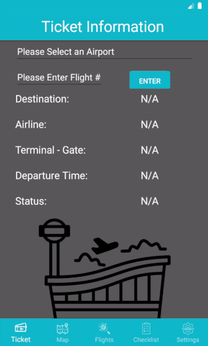
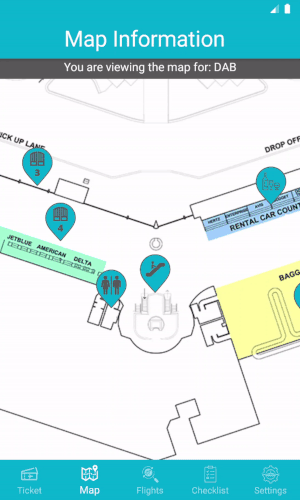

# Trp: The Airport Navigation App

TRP is an android phone application created as a **class project** for the **SE 300 class**. The app is designed to help users navigate large airports. Ticket information, departing flights, maps, and amenity locations in the airport are all easily viewable to the user.

## Features
⠀⠀⠀⠀⠀⠀

⠀⠀⠀⠀⠀⠀

⠀⠀⠀⠀⠀⠀Enter your airport and flight number to see ⠀⠀⠀⠀⠀View a multi-layered map of your airport with ⠀⠀⠀⠀⠀⠀ relevant information to your flight! ⠀⠀⠀⠀⠀⠀⠀⠀⠀⠀markers indicating special points of interest.

⠀⠀⠀⠀⠀⠀

|  |  |
|--|--|
| Enter your airport and flight number to see relevant information to your flight! | View a multi-layered map of your airport with markers indicating special points of interest. |

